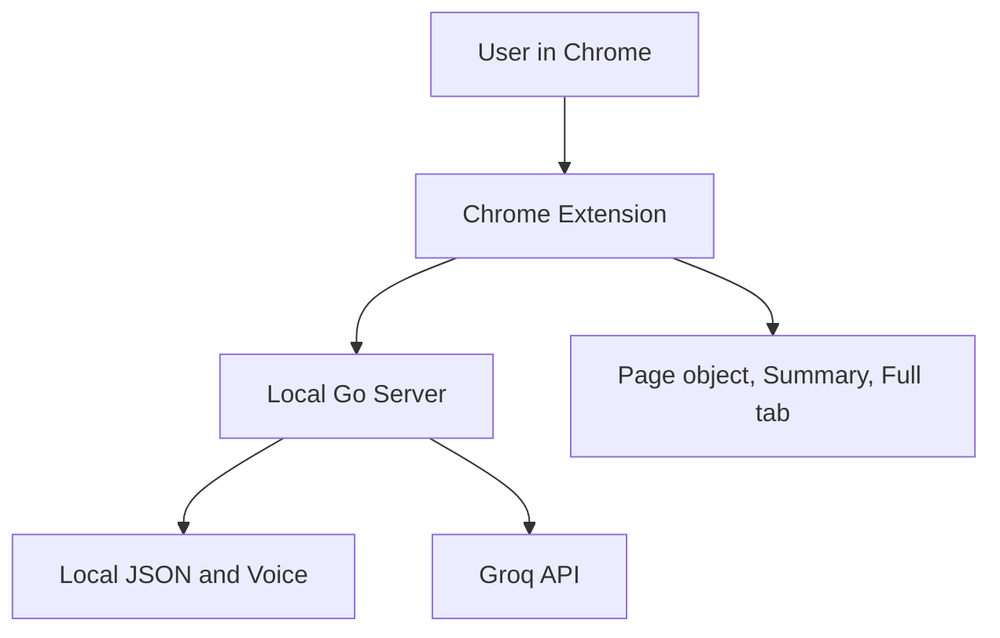
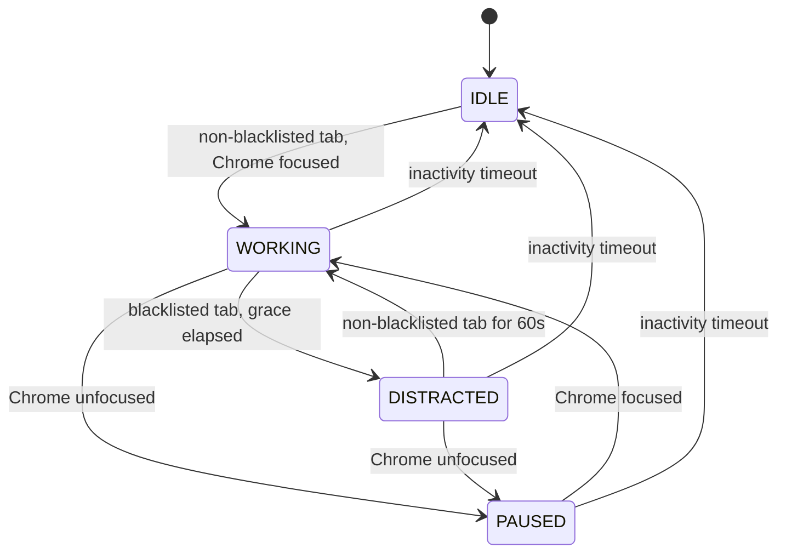
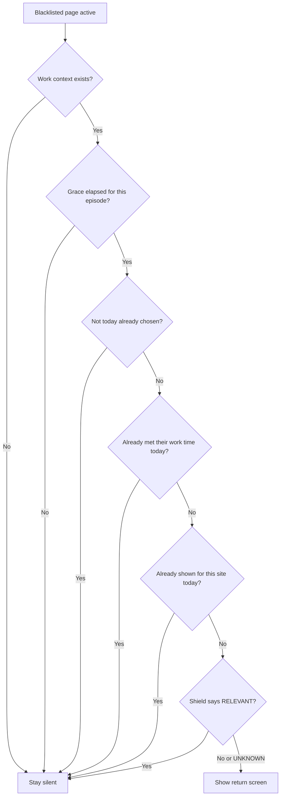

# Architecture Plan v2.0 — ADHD Focus Companion

**Status:** Upgraded architecture for the hackathon MVP
**Supersedes:** v1.0
**Related document:** `mvp.md` v3

### v2.2 corrections

An implementation pass against v2.1 built Phase 2 successfully and surfaced six real defects, all fixed here.

Corrected: "shown" now means delivered and acknowledged, so a dropped command no longer burns the day (§8) · `chrome.idle` activity signal added, without which inactivity measured nothing (§5.4) · segment credit cap (§5.5) · the work-time-met rule added to the flowchart, not only the table (§8) · `beforeunload` removed from anchor capture (§9) · blacklist route added (§14) · announcement format fixed, since total step count is unknowable (§12) · suffix matching clarified (§7) · **interface language: Greek by default, English toggle** (§12).

### v2.1 corrections

A gap analysis found that v2.0 reintroduced the offline failure it was written to remove: `UNKNOWN` classification suppressed the return screen, and Groq being down produces `UNKNOWN`. Fixed in §6, plus nine other ambiguities.

Corrected: shield return values (§6) · state transitions no longer reference the shield (§5.2) · site identity and deterministic paths (§7) · grace accounting and intervention lifecycle (§8) · return anchor split into `lastWorkTab` and `bestAnchor` with capture timing (§9) · plan structure and completion threshold (§9b) · `/browser/event` contract and `SHOW_GREETING` (§14) · voice recording moved to Phase 2 (§21) · per-developer servers (§20).

**Known open item:** the MVP's *«Απομένουν 2 προτάσεις»* has no data source. Decide or delete.

### What changed from v1.0

| # | Change | Reason |
|---|---|---|
| 1 | Focus session no longer depends on AI classification | v1.0 died silently when Groq was unreachable |
| 2 | Timestamps and heartbeat alarms replace timers | MV3 service workers are killed after ~30s idle |
| 3 | Return anchor capture fully specified | It was a data field with no implementation |
| 4 | Accessibility is a first-class concern with an owner | Absent from v1.0; this is an accessibility hackathon |
| 5 | Honest privacy statement instead of "zero privacy concern" | v1.0 contradicted `mvp.md` |
| 6 | Blacklist defaults defined | The trigger of the core feature was undefined |
| 7 | Difficult-day rule defined | Referenced everywhere, specified nowhere |
| 8 | One floating object on the page (lamp and character unified) | v1.0 split capture and character across surfaces |
| 9 | API reduced; evaluate calls folded into the event response | Fewer round trips, less code |
| 10 | Demo target is 6 minutes | Official format is 6 min presentation + demo, 3 min Q&A |

---

## 1. Purpose

The product helps a person advance **one active primary goal** without requiring them to organize anything. The application observes browser context, offers non-intrusive return guidance, exposes one current step, and evolves a 3D planet through five eras as confirmed progress accumulates.

Designed for: a working demo, four developers on **two machines**, local-first privacy, minimal interaction, and controlled visual scope.

---

## 2. Locked decisions

| Area | Decision |
|---|---|
| Primary goal | Exactly **one active primary goal** |
| Plan structure | `Goal → Milestones → This Week → Today → Current Step` |
| Main client | Chrome Extension, Manifest V3 |
| Surfaces | Page overlay (one object), compact summary, full tab |
| Backend | Local Go HTTP server on `127.0.0.1` |
| Persistence | Local JSON; voice stored locally as a media file |
| External AI | Groq, called only by the Go server |
| Privacy model | Local-first. Domain and page title may be sent for classification. Never page content, cookies, forms or voice |
| **Focus session** | **Starts deterministically. AI improves accuracy, never enables the feature** |
| **Timing** | **Timestamps in Go + `chrome.alarms` heartbeat. Never `setTimeout` in the service worker** |
| Interventions | Blacklist only, after grace, at most once per site per day |
| Visual progression | Five eras, driven only by confirmed progress |
| Character | Animated sprite, two behavior states, five era outfits |
| **Accessibility** | **P0. Keyboard, contrast, reduced motion, screen reader announcements** |
| Demo support | Controllable App Clock, hidden keyboard shortcut, no visible dev panel |

---

## 3. System context



**The extension knows what is happening in the browser.** Active tab, URL, title, focus changes, time segments, clicks, rendering.

**Go decides what those events mean.** Session state, intervention permission, completion prompts, plan generation, progress and era, recovery, persistence, Groq requests.

Business rules are never duplicated in JavaScript.

---

## 4. Runtime architecture

### 4.1 Background service worker

Coordinates browser events. Does not decide anything.

- Listens for tab activation, navigation, update, removal, window focus
- Converts raw activity into compact time segments
- Talks to the Go server
- Routes commands to the page object
- Opens the compact summary and full tab
- Stops all tracking when the server is unavailable

> ⚠️ **The worker is killed after roughly 30 seconds of inactivity.** Any `setTimeout` inside it dies with it. See §5.3.

### 4.2 The page object (one floating element)

The content script injects **exactly one** element into ordinary pages, inside a Shadow DOM so site CSS cannot break it.

**It is the lamp in its resting state and the character when it speaks.** Same anchor, same position, upper right.

| State | Behavior |
|---|---|
| **Resting (lamp)** | Small, low opacity, brightens on hover. Brightness reflects unreviewed idea count (off / medium / full) |
| **Capture** | One click opens a small inline box, in place. Choose `Idea` or `Task`, type, done. No window, no navigation |
| **Speaking (character)** | Expands into the character with a speech bubble and action buttons, then returns to lamp state |
| **Lamp behavior** | lamp can be moved anywhere on the screen and lamp becomes the character | 

Also reachable by **keyboard shortcut** (`chrome.commands`) from anywhere: press, type, gone. This is both the lowest-friction capture path and an accessibility requirement.

Never blocks the page. Never replaces content. Can be hidden per site.

**P0 capture invariant — save for later, keep my place.** `Idea` and `Task` are parked items in the existing idea store, not new plan steps. Go saves the item without changing Current Step, the active primary goal, `lastWorkTab`, `bestAnchor`, focused-time counters or progress. Priority ordering applies only to parked items. The extension confirms the save inline and returns to the existing work context; no navigation, new task list or new goal. Saving works without AI; optional classification must not delay saving or change the plan.

### 4.3 Compact summary

Opened from the **Chrome toolbar icon (the planet)** or by clicking the page object.

Contains only: mini 3D planet, current step in one line, minimal progress, maximize action, `Server unavailable` state when needed.

The existing Current Step presentation offers **one user-requested smaller starting action** (§9b), inline rather than on a new surface. If implemented, **P1 only**, Pause/Resume is available here and AI-off in the existing full-tab settings; both reflect Go-owned preferences.

> Chrome allows **one** toolbar icon per extension. The planet is that icon. The lamp lives on the page, not in the toolbar.

### 4.4 Full tab

Opened on request, not kept open. Full planet, the single goal, milestones, week, today, current step, ideas, progress and era, voice recording, blacklist settings.

### 4.5 Go server

**API layer:** validates, maps to services, returns explicit UI commands with a machine-readable reason. No domain rules.

| Service | Responsibility |
|---|---|
| Goal and Plan | onboarding, one-goal enforcement, plan generation, current-step selection |
| Focus Session | deterministic state transitions from browser events |
| Relevance | deterministic rules, cache, optional Groq refinement |
| Intervention | blacklist, grace, metadata shield, daily frequency |
| Completion | decides when to ask; records only explicit confirmation |
| Progress and Era | weighted progress, era thresholds, planet and outfit state |
| Return Anchor | stores and serves the last useful context per step |
| Ideas | capture, classification, priority |
| Recovery | absence detection, difficult-day escalation, replanning |
| Voice | local recording metadata, playback cooldown |
| App Clock | real time normally, offset time in demos |

---

## 5. Focus session model (rewritten)

Sessions start automatically. The optional **P1** Pause/Resume control below is an explicit break from the companion, not a required session Start/Stop workflow.

### 5.1 States

| State | Meaning |
|---|---|
| `IDLE` | No recent work context |
| `WORKING` | A work context exists |
| `DISTRACTED` | A work context exists and the active tab is an unprotected blacklisted page |
| `PAUSED` | Chrome unfocused |

### 5.2 Deterministic entry (the critical fix)

`WORKING` is entered by **deterministic rules alone**:

1. Onboarding is complete, **and**
2. The active tab is **not** blacklisted, **and**
3. Chrome has focus

That is a **weak work context** and it requires no network at all.

Groq classification, when available, upgrades it to a **strong work context** (used for better return anchors and smarter completion prompts). Classification never gates the state.



> **State transitions contain no AI input whatsoever.** The shield decides only whether the return screen is *shown*, never which state we are in. Entering a blacklisted tab keeps the session in `WORKING` with `distractionStartedAt` set; `DISTRACTED` begins only when grace elapses.

> **Consequence:** with Groq unreachable, the blacklist, the grace period and the return screen all still work. Only the shield and the anchor quality degrade. The demo survives bad venue wifi.

### 5.3 Timing without timers

**Never `setTimeout` in the service worker.**

- Go stores `distractionStartedAt`, `lastRelevantActivityAt`, `lastEventAt` as timestamps
- On every browser event, Go computes elapsed time and decides
- A **`chrome.alarms` heartbeat (1 minute)** covers the passive case: user watching a video, producing no events
- Alarm granularity is roughly one minute. Do not depend on sub-minute precision. The grace period is "about five minutes", not exactly five

Grace period (5 min) and inactivity timeout (15 min) are configuration values in one place.

### 5.4 The user activity signal

A heartbeat proves only that Chrome is open, not that a person is there. Without a real signal, inactivity means nothing and accumulated step time keeps running while the user is away, which fires the completion prompt at the wrong moment.

- The extension uses **`chrome.idle` with a 60-second threshold** and reports `active` / `idle` / `locked` as ordinary event fields
- **Focused time accumulates only while `active`.** `idle` and `locked` pause it exactly like an unfocused window
- `WORKING → IDLE` fires after the inactivity timeout measured in `active` time

### 5.5 Segment credit cap

A closed interval is credited at most **180 seconds**, regardless of wall-clock length.

Without this, a laptop that sleeps for three hours credits three hours of focused work, and progress estimates become fiction.

### 5.6 Persistent Pause/Resume — P1 only, if time permits

- Persist `Settings.companionPaused` locally, default `false`. This override precedes ordinary session transitions and keeps the session `PAUSED`. Only an explicit Resume clears it; focus, activity, browser/server restart and midnight cannot resume the companion.
- On Pause, Go closes the preceding interval normally (including the 180-second cap), sets `PAUSED`, and stops accumulating focused work and grace. While paused, browser events maintain only the observation/time baseline: no new browsing segments, work-context/anchor updates, relevant-work refreshes or unsolicited prompts. No paused interval is credited later.
- Preserve the goal, plan, confirmed progress, world, outfits, saved anchor and focused time already accumulated on the current step. Pause/Resume itself never completes anything.
- On Resume, Go establishes a new observation baseline and starts from `IDLE`, with no recent-work eligibility or distraction episode and with session-focused time reset. Ordinary active work establishes the next session; a subsequent blacklist visit receives fresh grace. Saved return context and step-focused time remain available.
- No missed greetings or ramps are queued. The existing single pending completion prompt remains subject to its original expiry and snooze (§9b); it is not duplicated or given an extended lifetime. Resume itself emits no catch-up prompt. No guilt language or loss of progress.
- User-requested capture, starting cues and inspection of the saved plan remain available. They neither clear pause nor resume accounting. An explicit confirmation of the actual parent step remains real confirmed progress under the unchanged rules.

---

## 6. Relevance classification

Decision ladder, cheapest first:

1. Normalize page identity (domain + canonical URL + title signature)
2. Check the local cache (`map[signature]result`, in memory, persisted with state)
3. Deterministic rules: known blacklist entries, previously seen pages, extension's own pages
4. Only if still unknown and only where it matters: minimal metadata to Groq
5. Store the result with an expiry

### Groq payload (maximum)

Primary goal summary, current milestone, current step, page domain, page title, and channel or short description where available.

**Never sent:** page body, cookies, form values, full history, voice audio.

### Shield return values

The shield has exactly three outcomes, and they behave differently depending on whether the page is blacklisted. **This is the single most important table in the document.**

| Shield result | On a blacklisted page | On any other page |
|---|---|---|
| `RELEVANT` | **Silence.** Real work on a distraction platform | Silence |
| `NOT_RELEVANT` | **Show the return screen** | Silence |
| `UNKNOWN` (includes Groq down) | **Show the return screen** | Silence |

**Why `UNKNOWN` shows the screen on a blacklisted page:** the blacklist already made that decision deterministically. The shield exists only to *cancel* an approved interruption when it has positive evidence of relevance. With no evidence, the deterministic decision stands.

> The rule "never interrupt on an assumption" means **never invent a distraction on a page nobody flagged.** On a blacklisted page nothing is being invented.

### Fail-safe

- Groq unavailable or low confidence → `UNKNOWN`
- `UNKNOWN` on a non-blacklisted page never creates an interruption
- The shield can only **suppress** an interruption, never trigger one
- **With Groq completely unreachable, the product behaves as if the shield did not exist.** Blacklist, grace, return screen: all unaffected

---

## 7. Blacklist

**Defaults, shipped and enabled, not hidden from the user but not required to configure:**

`youtube.com` · `instagram.com` · `tiktok.com` · `x.com` / `twitter.com` · `facebook.com` · `reddit.com` · `twitch.tv` · `netflix.com`

The user can add or remove entries in the full tab.

### Site identity

- Matching is **suffix match at a dot boundary** against the blacklist entry, so `m.youtube.com` and `old.reddit.com` match `youtube.com` and `reddit.com` automatically. A true registrable-domain parse needs a public suffix list and a third-party dependency; for a curated list this is equivalent
- An **alias table** merges sites that are one product: `x.com` = `twitter.com`. Aliases share one once-per-day key
- The once-per-day key is the registrable domain after alias resolution
- User entries are stored as bare domains; anything else is rejected at input

### Deterministic distraction paths

Certain paths are distraction by definition and **never reach the shield**:

`youtube.com/shorts/` · `instagram.com/reels/` · `facebook.com/reel/`

These skip the Groq call entirely. Cheaper, faster, and they cover where most of the time actually goes.

### Explicitly excluded: adult sites

**Decision: not shipped as defaults, now or later.**

Sexual orientation and sex life are a **special category under GDPR** with far stricter requirements. A page title from such a site leaving the machine for an external API is exactly that category. This is the one entry that would create real legal exposure, for no product benefit.

If ever supported, it must be: user-added only, **domain match only, no metadata read, nothing sent, nothing logged**.

---

## 8. Intervention decision flow

Go applies the common suppression policy below **before** selecting any unsolicited command or calling the shield. The ramp-specific flow then applies unchanged.



> The shield is the **last** check, not the first. Everything before it is deterministic, so the Groq call happens at most once per site per day.

### Grace period accounting

| Question | Answer |
|---|---|
| Scope | Per site, per **continuous episode** |
| Starts | On entering a blacklisted site with a work context |
| Resets | After **60 continuous seconds** on a non-blacklisted page. Shorter returns do not reset it |
| `PAUSED` time | Does not count toward grace |
| YouTube → Reddit | A new episode with its own grace, and its own once-per-day key |
| "If they met their time" | The onboarding answer (10 / 25 / 45 min). If confirmed focused work in this session already exceeded it, **no interruption at all for the rest of that session** |

### The return screen

Contains the exact current step, the return anchor when available, and three actions:

| Action | Effect |
|---|---|
| **Continue** | Switches back to `lastWorkTab` |
| **I want to browse** | Silence for this site today |
| **Not today** | Suppresses **all unsolicited greetings, return screens and completion prompts** until local midnight. User-requested interactions remain available |

**All three cost exactly the same: nothing.** No second confirmation, no penalty, no streak loss. Buttons are spaced apart.

### Lifecycle rules

- **"Shown" means delivered and acknowledged.** Go marks the `InterventionRecord` as `issued`; the content script sends an ack once the screen is actually rendered, and only then does it become `shown` and consume the site's one chance for the day.
- **A command that never reaches a tab is dropped and does not count.** Without the ack, a `SHOW_RAMP` that arrived while no tab could receive it would silently burn that site's only opportunity
- The same applies to `SHOW_GREETING`. `ASK_COMPLETION` is exempt: it also appears in the summary and full tab, so it cannot be lost
- An acknowledged screen is not re-armed. It disappears on navigation and does not return that day
- **Undo window: 5 seconds.** Undo reverts the suppression only, nothing else
- A "day" is local midnight according to the App Clock

*(Final button wording TBD. The rule is that honesty must never cost more than a lie.)*

### Common silence policy — P0

Every unsolicited interaction is brief, nonmodal, does not steal focus and requires no immediate response. Go owns eligibility; JavaScript only relays decisions and renders/dismisses UI.

| Condition or choice | Greeting | Return ramp | Completion prompt |
|---|---|---|---|
| Chrome unfocused, user idle/locked, or no eligible receiving page | Suppressed | Suppressed | Suppressed |
| Not today, until local midnight | Suppressed | Suppressed | Suppressed |
| I want to browse, for that site today | Suppressed on that site | Suppressed on that site | Suppressed on that site |
| Not yet, for the current completion prompt's 30-minute snooze | Normal eligibility | Normal eligibility | Suppressed |
| Persistent Pause, **P1 only** | Suppressed until Resume | Suppressed until Resume | Suppressed until Resume |

- All other existing eligibility rules still apply. Meeting the session's work-time target suppresses the ramp only; it is not a new global silence preference.
- Requests to capture a thought, ask for a starting cue, open the summary/full tab or answer a parent-step question are not unsolicited and are not blocked by this policy. Opening a surface may display the existing pending question without generating a new interruption.
- Suppression neither consumes greeting/site delivery eligibility nor queues missed commands. Dropped greetings/ramps may be freshly evaluated on a later eligible event; never replay their old commands. Only the already-required `PendingPrompt` is retained, with its existing snooze and end-of-day expiry.
- Applying a silence choice dismisses any currently displayed unsolicited UI within its scope. Go returns dismissal instructions with the action response; the worker relays them to open content scripts. User-requested UI stays open. While a suppression-changing request is outstanding, the worker drops unsolicited deliveries; once it resolves, it also discards decisions from browser requests begun before that response. Subsequent events are evaluated afresh in Go. Nothing is queued and discarded commands do not consume eligibility.

---

## 9. Return anchor (new)

This is the emotional core of the return screen. It must be specified, not assumed.

### Two separate things, not one

v1.0 collapsed these into a single field. They have different rules.

| | Purpose | Update rule |
|---|---|---|
| **`lastWorkTab`** | Where **Continue** sends you | Always overwritten by the most recent non-blacklisted tab |
| **`bestAnchor`** | The snippet the screen shows | Overwritten **only by an equal or higher tier** |

Without this split, opening Gmail for thirty seconds would destroy the anchor from an hour of real writing.

### Tiers

| Tier | Source |
|---|---|
| **1** | A focused text field, textarea or contenteditable: the last ~120 characters before the caret |
| **2** | The current text selection |
| **3** | The heading nearest the top of the viewport, plus scroll percentage |
| **4** | The page title |

Tier 1 is never replaced by tier 3 or 4. Any tier replaces an older anchor of the same tier.

### When captured

**The content script cannot read anything after the page is hidden.** So capture happens continuously, not on demand:

- every **30 seconds** while the page is visible
- on `visibilitychange` (fires before the page hides)

> **Not `beforeunload`.** Asynchronous message passing does not complete in that handler, and registering the listener disables the back/forward cache. `visibilitychange` covers the same moment reliably.

The worker heartbeat never triggers capture; it only asks Go for a decision.

### Stored

`{ tier, url, title, snippet, scrollPercent, capturedAt }` — one anchor per step.

### Hard rules

- **Never** captured from `input[type=password]`, fields with `autocomplete` indicating credentials or payment, `aria-hidden` subtrees, cross-origin iframes, or any blacklisted page
- **Never** sent to Groq. Stays on disk, used only to render the return screen
- Snippet truncated to 120 characters, stored as plain text
- Pages with no content script (`chrome://`, PDF viewer, the Web Store) produce no anchor and do not clear the existing one
- **Continue** uses the `lastWorkTab` tab id; if that tab was closed, it opens the anchor URL; if there is none, it opens the full tab

> **`Απομένουν 2 προτάσεις` in the MVP has no source.** Either it is derived from the step text or it is removed. Do not invent a counter.

---

## 9b. Plan structure and completion

### Week and Today are views, not entities

`Milestone` holds `Step`s. Each step has an optional `scheduledFor` date.

- **This Week** = steps whose `scheduledFor` falls in the current week
- **Today** = steps whose `scheduledFor` is today
- **Current step** = the first step with status `pending`, in order

Nothing is stored for Week or Today. This removes two entities and all their synchronization problems.

### Smaller starting action — P0

- From Current Step, the user requests `POST /steps/start-cue` with `stepId`. Go validates that it is still the current pending step; a missing or stale step returns `409` and no cue.
- P0 uses a deterministic Go template, with no generative-AI request: **"Read just the current step once."** Return one short cue linked to the parent step, not a breakdown or list. This same method works when AI is unavailable or off.
- No persisted cue is needed. Return `{stepId, text, progressWeight: 0}`; the UI displays one transient cue inline and discards it when Current Step changes. It is not a `Step`, has no completion status and cannot be submitted as a completed step.
- Requesting or following the cue does not replace or complete the parent, change its weight or estimated duration, reset its focused time, change work context, or advance goal progress, planet, era or outfit. Ordinary browser accounting remains unchanged; requesting a cue grants no time credit.
- `ASK_COMPLETION` still refers only to the actual parent step and its existing threshold. A cue neither creates nor clears a `PendingPrompt`, alters its snooze, nor provides a separate completion button. Confirming the parent means the original step is complete, not merely the cue.
- The request is always user-initiated and exempt from unsolicited-prompt suppression. Go being unavailable uses the existing unavailable UI, not business logic in JavaScript. No learned personalization or full adaptive breakdown is introduced.

### What Groq generates

- **All** milestones for the goal, with a weight each
- Steps for the **current milestone only**, not the whole goal

Generating every step up front is slow, wrong by the time you reach it, and wasteful. The next milestone's steps are generated when the previous one completes.

Go normalizes weights so they sum to 1. Step weights are the milestone weight divided evenly. The target horizon comes from the goal sentence if it contains a date, otherwise Groq proposes one and the user sees it in the full tab.

**Invalid plan** means: not valid JSON, no milestones, a milestone with no title, or weights that cannot be normalized. One repair request, then show retry.

### Generative-AI off — P1 only, if time permits

- Persist `Settings.generativeAIEnabled` locally, default `true`. Only an explicit preference change can re-enable it. This setting is independent of Pause and is not a silence switch.
- Go checks the preference before every new generative request, including retries/repairs, plan generation and optional classification. While off, make no such requests; cancel outstanding requests where possible and discard their results. Re-enabling must not apply discarded results.
- The saved plan, deterministic sessions, grace, blacklist, confirmation, progress, starting cues and lamp capture remain usable. The metadata shield returns `UNKNOWN` without a request, using the existing deterministic fallback and suppression rules.
- If initial plan generation is required while off, return `ai_disabled` without creating a partial active goal. If the next milestone needs steps, preserve the saved plan and all confirmed progress but leave generation blocked; do not invent a current step, auto-complete the goal or repeatedly retry. Existing generated steps remain usable.
- Summary/full state exposes a derived `planGenerationBlocked: "ai_disabled" | null` when applicable. Explain the boundary inline; the user may explicitly enable AI and retry the pending generation. No automatic re-enable, new planning surface or manual plan-authoring workflow.

### When the completion prompt fires

Phase 2 does this **without Groq**.

- Accumulate focused time on non-blacklisted pages while the step is current
- The threshold is **80% of the step's estimated duration**
- The prompt fires when the user **leaves the work context** after the threshold, or on the next heartbeat if they stay
- **"Not yet"** silences the prompt for 30 minutes, then it may fire again
- A pending prompt is stored in state and shown on the next eligible page the user opens, subject to the common silence policy (§8). It expires at end of day; suppression does not extend its lifetime

---

## 10. Progress and the five eras

### Progress source

Progress changes **only** after the user confirms a proposed step is complete.

Browsing time, session length, idea count and AI assumptions can never increase progress.

Each plan carries normalized weights. Go computes `confirmed weight / total weight`, so ten trivial tasks cannot outweigh one milestone.

### Era thresholds

| Progress | Era | Signature elements | Outfit | Tone |
|---|---|---|---|---|
| 0–20% | Prehistoric | wild terrain, rocks, fire | fur | simple, instinctive |
| 21–40% | Bronze Age | paths, settlements, monuments | early civilization | discovery, building |
| 41–60% | Industrial | workshops, machines, rail | industrial | momentum, making |
| 61–80% | Modern | infrastructure, city lights | modern | clear, calm |
| 81–100% | Cyberpunk Future | neon city, skyscrapers, flying taxis | futuristic | confident, hopeful |

The future era begins building after 80%; the complete city appears at 100%. Bright and beautiful, not dystopian.

### Visual implementation rule

**One reusable scene, not five worlds.** Continuous parameters change within an era (color, light, vegetation, density, atmosphere, motion). A small set of signature objects unlocks at thresholds. The same `PlanetVisualState` drives both mini and full renderers, with reduced geometry in the mini.

Character: five sprite sheets, each containing only `calm` and `active`.

> **All five era asset sets are produced before the hackathon**, in a single session with one shared style and palette prompt. Producing them on different days yields five different games.

---

## 11. Difficult day and recovery (new)

### Definition

**A difficult day is a calendar day with zero confirmed steps.** Nothing else. No AI, one line of code.

### Escalation

| | Behavior |
|---|---|
| **1st difficult day** | **Absolutely nothing.** No reaction, no change. Everyone has bad days; commenting on it is already criticism |
| **2nd consecutive** | The step becomes a **door, not a task**: "open the file", not "write the intro". The goal is motion, not output |
| **3rd and beyond** | **Return the user's own ideas**: *"You wrote this ten days ago. Want to work on that instead today?"* |

**Why the third tier works:** a stored idea is something **the user** wrote while excited. Nobody is imposing it. By the third bad day the plan has lost its force, but curiosity has not. Whatever they do, it breaks the zero, which is the only objective.

### The silent rule

**The application never states that there were bad days.** No "three days now". It simply becomes smaller, quietly. Adaptation is never announced.

### Absence recovery

Five or more inactive days → replan the unfinished chain without failure language, present the new date and one small next step. The local voice may play only if its cooldown (5 to 7 days) permits. No streak, no red, no lost progress.

---

## 12. Accessibility (new, P0)

This is an accessibility hackathon with accessibility experts on the panel. The product is visual by nature, which makes this a scored risk rather than a nice-to-have.

### Requirements

| | |
|---|---|
| **Semantic markup** | Real `<button>` elements, never styled `<div>`. Keyboard and screen reader support come free |
| **Keyboard** | Full flow reachable with Tab and Enter. Escape closes the bubble. Capture reachable via `chrome.commands` shortcut |
| **Focus** | The bubble **does not steal focus** (that would interrupt typing). It announces itself and is reachable by shortcut |
| **Screen reader** | `aria-live="polite"` announces step completion, progress and era change. Without this, the core reward does not exist for a user who cannot see |
| **Shadow DOM** | Keep the live region and its content **inside the same shadow root**. ID references do not cross the shadow boundary |
| **Reduced motion** | `prefers-reduced-motion` stops planet rotation, idle animation and transitions. This also satisfies the challenge's sensory-friendly requirement |
| **Contrast** | WCAG AA: 4.5:1 for text, 3:1 for UI components |
| **Never color or motion alone** | Text beside every visual signal: "Step 3 of 8" beside the bar, "6 ideas" beside the lamp, era name beside the planet |
| **Target size** | Minimum 24×24 px for all controls |

### Announcement format

Steps are generated one milestone at a time (§9b), so **the total step count of the goal is unknown** and "Step 4 of 8" cannot be produced. Use the milestone count plus overall progress, which the weights do give us:

> *"Step 2 of 5 complete. Overall progress 34 percent. Era: Industrial."*

### Interface language

**Greek is the default. English is a toggle in the full tab.**

The audience, the judges and the team are Greek. Code, comments and these documents stay English.

- One dictionary module, `shared/strings.js`, with `el` and `en` keys. Every visible string goes through it, none inline
- **Not `chrome.i18n`**: it follows the browser locale and cannot be switched at runtime, and `_locales` is more machinery than two objects
- The preference lives in server state, so every surface agrees
- `<html lang>` is set accordingly, which matters for screen reader pronunciation

### The test

**Unplug the mouse. Run the entire flow with Tab and Enter.** If you get stuck, so will the judge. Ten minutes, once, before Sunday.

---

## 13. Core data model

| Entity | Essential data |
|---|---|
| UserProfile | preference answers, onboarding state, created date |
| PrimaryGoal | id, statement, voice reference, status, target horizon |
| Milestone | id, goal id, title, order, weight, status |
| Step | id, milestone id, text, estimated duration, weight, status, scheduledFor |
| ReturnAnchor | step id, tier, url, title, snippet, scrollPercent, capturedAt |
| WorkContext | lastWorkTabId, lastWorkUrl, focusedTimeOnStep |
| PendingPrompt | type, step id, createdAt, snoozedUntil |
| FocusSession | state, contextStrength, startedAt, lastRelevantActivityAt, distractionStartedAt |
| BrowsingSegment | domain, page key, start, end, duration |
| RelevanceCache | signature → result, expiry |
| BlacklistEntry | domain, enabled, source (default or user) |
| InterventionRecord | site, date, choice |
| Idea | text, type, priority, createdAt, reviewed |
| ProgressState | confirmed weight, total weight, percentage, era |
| PlanetVisualState | normalized parameters, unlocked signature elements |
| CharacterState | era outfit, calm/active, current message |
| DayRecord | date, confirmedSteps, difficultDayStreak; daily greeting acknowledgement and Not today suppression |
| RecoveryState | lastActiveDay, absenceDays, replan status |
| Settings | timeouts, Groq config reference, demo clock offset; **P1 only:** companionPaused (default false), generativeAIEnabled (default true) |

**No new P0 entity.** Starting cues are transient responses keyed by the current step id, with zero progress weight. Lamp items remain `Idea` records, outside the active plan. Reuse the daily suppression, site-choice and pending-prompt snooze state for §8; issuing a command is not acknowledgement. P1 plan-generation blocking is derived, not another persisted status.

### Persistence

`state.json` holds everything. `voice/` holds the recording. Write to a temp file and rename. **No lock manager, no backup rotation, no migrations.** One repository interface isolates JSON so storage can change later.

User data and secrets excluded from Git.

---

## 14. API contract

All local, under `/api/v1`.

| Route | Purpose |
|---|---|
| `GET /health` | Readiness and API version |
| `GET /state/summary` | Character, step, progress, era, mini-planet |
| `GET /state/full` | Full state for the tab |
| `POST /onboarding` | Profile, goal, first plan |
| `POST /voice` | Store the local recording |
| **`POST /browser/event`** | **Submit events and receive the decision:** `SHOW_RAMP`, `ASK_COMPLETION` or `DO_NOTHING`, with reason and payload |
| `POST /ramp/respond` | Continue / Browse / Not today |
| `POST /steps/respond` | Yes / Not yet; recalculates progress on Yes |
| `POST /steps/start-cue` | **P0:** request one zero-weight starting cue for Current Step |
| `POST /anchor` | Store the current return anchor |
| `POST /ideas` · `GET /ideas` | Capture and treasure |
| `GET /blacklist` · `POST /blacklist` | List, add and remove entries. Bare domains only; anything else rejected |
| `GET /summary/day` | Day summary: confirmed steps, protected time |
| `POST /demo/clock` | Demo only, hidden shortcut |
| `POST /preferences` | **P1 only:** set persistent Pause/Resume and/or generative-AI preference |

### Approved scope additions

- `POST /steps/start-cue`: body `{stepId}`; response `{stepId, text, progressWeight: 0}`. `409` means the requested step is no longer current or there is none. This response is user-requested UI, not a browser command or completion acknowledgement.
- `POST /ideas` retains its existing capture contract. Saving parks the item locally and preserves Current Step, active goal, return context and progress; optional AI enrichment is not a prerequisite for success.
- Suppression-changing action responses include optional `dismissUnsolicited: {commands, site?}`. Go supplies the affected command names and optional site scope; omitting `site` means all pages. The worker relays these render instructions and invalidates outstanding deliveries as specified in §8, without deriving suppression policy itself. No new unsolicited-command backlog.
- **P1 only:** `POST /preferences` accepts `{companionPaused?: boolean, generativeAIEnabled?: boolean}`; omitted fields remain unchanged. Go persists the changes and returns effective preferences plus any dismissal instructions. Resume is explicitly `companionPaused: false`; it does not enable AI. Summary/full responses expose these preferences and the derived `planGenerationBlocked` reason. Generation requests blocked by the preference return `409` with `reason: "ai_disabled"`; no automatic retry while off.

**The evaluate endpoints from v1.0 are gone.** The decision travels back with the event that caused it.

### The `/browser/event` contract

**One event per browser signal.** No batching. The extension sends raw signals, Go builds the segments.

Event types: `tab_activated` · `tab_updated` · `tab_removed` · `window_focus` · `window_blur` · `heartbeat`

- **Go stamps the time on receipt.** The extension never sends a timestamp. This avoids clock skew and makes the App Clock work for free
- The response carries **exactly one command**

| Command | Meaning |
|---|---|
| `DO_NOTHING` | The common case |
| `SHOW_RAMP` | With step text and anchor |
| `ASK_COMPLETION` | With step text |
| `SHOW_GREETING` | First tab of the day. *"Want to see your planet?"* |

- A `heartbeat` response returns to the worker, which routes any command to the **currently active tab**. If no tab can receive it, the command is dropped, not queued
- Every response carries a machine-readable `reason` so the demo can be diagnosed without duplicating rules in JavaScript

---

## 15. Server unavailable

Show `Server unavailable`. Character inactive. Tracking stops. Nothing stored, nothing sent, no interventions. Bounded backoff retry. State refetched on reconnect.

**Fail silent, never fail noisy.**

---

## 16. Privacy and security

- Go listens only on `127.0.0.1`; requests accept only the extension origin
- The Groq key exists only in the server environment, never in extension files
- **Domain and page title may be sent** for classification. Page bodies, cookies, form values and full history never are
- Voice audio and return anchors **never leave the machine**
- Logs exclude secrets, voice and full browsing history
- If AI fails, the system becomes **less** intrusive, never more

### What we say out loud

> "We send domain and page title, never page content, never cookies, never form data. Your voice recording and your work context stay on your machine."

**Do not claim "zero privacy concern".** The honest sentence scores better than an inaccurate one in front of an ethics panel.

---

## 17. Failure strategy

| Failure | Behavior |
|---|---|
| Go unavailable | Disable, show compact unavailable state |
| **Groq unavailable** | **Classification returns `unknown`. Blacklist, grace and ramp keep working** |
| Groq unavailable during onboarding | Show retry; never create a malformed plan |
| Invalid plan structure | Validate, request one repair, then retry |
| JSON write failure | Keep last good state in memory, report recoverable error |
| Page object injection blocked | Tracking continues; summary available from toolbar |
| Three.js failure | Static era image fallback; all functional flows intact |
| Voice permission denied | Continue onboarding without voice |

---

## 18. Project structure

```text
project/
├── docs/            mvp.md, architecture-plan.md
├── extension/
│   ├── manifest.json
│   ├── background/   events, alarms, server client
│   ├── content/      page object (lamp + character), shadow DOM
│   ├── summary/
│   ├── dashboard/
│   ├── shared/       api, messaging, state, a11y
│   └── assets/       character/{prehistoric,bronze,industrial,modern,future}, planet/
├── server/
│   ├── cmd/server/
│   └── internal/     api, application, domain, groq, storage, clock
└── scripts/
```

---

## 19. Team ownership

Four people, **two machines** in the room.

| Person | Machine | Ownership |
|---|---|---|
| **A** | Machine 1 | Go server: API, rules, storage, Groq, App Clock |
| **B** | Machine 2 | Extension: manifest, background, alarms, content script, page object |
| **C** | Machine 2 | Three.js planet and character rendering, era parameters |
| **D** | Own laptop | **Presentation, demo script, accessibility pass, rehearsals** |

**D is not a spare person.** Presentation is one of five equally weighted categories, so it is 20% of the score. D also owns the keyboard-only test and the contrast check, because those are scored and nobody else will get to them.

Every file has one primary owner during the hackathon.

---

## 20. Before the hackathon

Nothing here is core feature work. Check the rules if unsure.

1. **All five era asset sets**, one session, one style and palette
2. **An empty extension loading in Chrome with a rotating sphere.** No bundler: plain ES modules, `three.module.js` vendored in `lib/`. This is the biggest infrastructure risk
3. Groq key and one working request from Go
4. Prompt drafts for: plan generation, relevance shield, idea classification, replanning
5. A rough keyboard-navigable button component

### Development environment

**Every developer runs their own Go server on their own machine.** No tunnel, no shared instance, no mock. The extension always points at `http://127.0.0.1:<port>`.

The origin allowlist is **Phase 5 hardening, not Phase 2.** Unpacked extension ids differ per machine, so enforcing it early blocks everyone for no benefit.

---

## 21. Implementation order

**Phase 1 — Walking skeleton.** Repo, extension loads, Go health endpoint, one round trip, empty state, unavailable state.

**Phase 2 — Core loop.** Onboarding (four questions, goal, **voice recording**), plan generation, browser events, **deterministic** session state, blacklist, grace, return screen, step confirmation, return anchor capture. **P0 scope additions:** one on-demand starting cue, basic lamp capture that preserves the current work context, and common unsolicited-interaction suppression.

> Voice **recording** is part of onboarding and belongs in Phase 2. Voice **playback** is Phase 4. v1.0 put both in Phase 4, which contradicted the MVP.

**Phase 3 — Reward.** Weighted progress, five eras, mini and full planet, five outfits, synchronized tone. These remain **P0**, including era transitions and confirmed-progress-only evolution; starting cues add no progress.

**Phase 4 — Supporting value.** Lamp brightness and treasure, voice, absence recovery, difficult-day escalation, day summary. **P1 only, if time permits:** persistent Pause/Resume and explicit generative-AI off. Basic lamp capture is already in the P0 core loop.

**Phase 5 — Hardening.** App Clock, seeded demo state, Groq fallbacks, **accessibility pass**, 6-minute rehearsal.

---

## 22. Acceptance criteria

Eight, not fifteen.

1. Exactly one active primary goal; the plan exposes one current step
2. Opening an ordinary tab starts a work context **with the Go server offline from Groq**
3. **Killing network access to Groq does not prevent the return screen from appearing**
4. The return screen appears only after grace, only on blacklisted sites, at most once per site per day, and shows a real return anchor
5. Browse and Not today cause silence, with no penalty of any kind
6. Progress changes only after explicit confirmation, and updates planet, era, outfit and tone together
7. **The entire core flow is operable with keyboard only, and step completion is announced to a screen reader**
8. Five simulated days of absence produce replanning with no failure language, and the whole story demos in six minutes on seeded state

---

## 23. Outside this architecture

Multiple goals · accounts or cloud sync · mobile and wearables · social comparison, currency or leaderboards · interventions on non-blacklisted pages · more than five eras · complex character emotions · a database or ORM · continuous AI surveillance · automatic progress without confirmation · adult sites in the default blacklist

---

## 24. Final rule

When a choice is unclear, pick the option that:

1. requires less organization from the user
2. produces fewer interruptions
3. keeps private data local
4. preserves one clear current step
5. **works when the network does not**
6. **is usable without a mouse and without sight**
7. fails silently rather than nagging

This protects the challenge requirement: help the user stay focused and in control **without the application becoming another distraction**.
