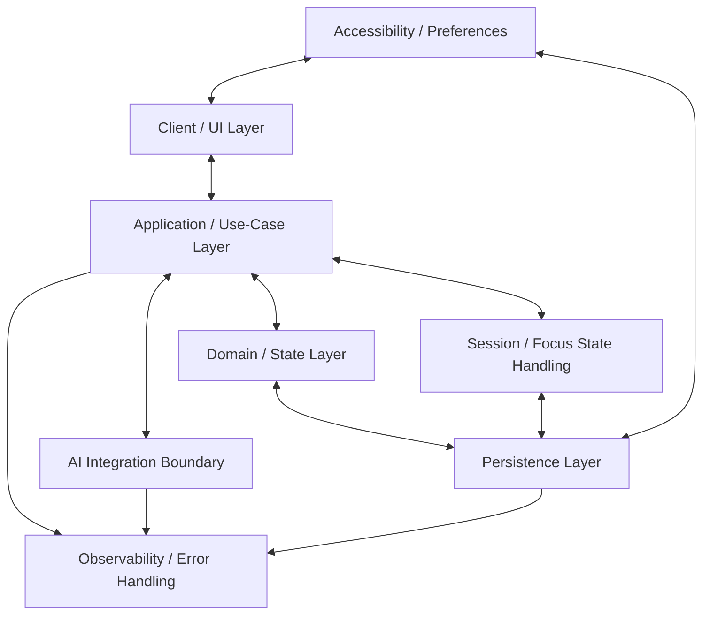

# M.B.A.X. MVP Architecture

## 1. Architecture Goals

The M.B.A.X. MVP architecture optimizes for a focused hackathon build: clear separation of responsibilities, resilient user-confirmed state, replaceable AI behavior, and enough structure to support the core focus-and-recovery loop without premature complexity.

## 2. Architecture Principles

- Use a modular monolith for the MVP.
- Keep hackathon architecture minimal and easy to reason about.
- Place AI behind a replaceable integration boundary.
- Keep user-confirmed state independent of AI availability.
- Provide manual fallbacks for AI-assisted flows.
- Persist Return Anchors and focus state independently of AI.
- Avoid premature integrations and microservices.

## 3. Core User Flow

Project Capture -> AI Next Action -> Action Confirmation -> Focus Session -> Distraction Parking -> Lost Focus / Stuck -> Adaptive Recovery -> Return Anchor -> Resume -> Completion / Gentle Progress

## 4. Logical Components

### 4.1 Client / UI Layer

- Responsibility: Present the MVP workflow, collect user input, and render confirmed state, focus sessions, distractions, recovery prompts, and progress.
- Owns: Screens, interaction states, local form state, accessibility affordances exposed to the user.
- Must Not Own: Business rules, persistence rules, AI decisions, or durable focus state.
- Communicates With: Application / Use Cases, Accessibility / Preferences, Observability / Error Handling.

### 4.2 Application / Use-Case Layer

- Responsibility: Orchestrate user workflows and coordinate between UI, domain state, persistence, AI, and session handling.
- Owns: Use-case flow control, command handling, validation sequencing, fallback routing.
- Must Not Own: Durable storage details, AI provider details, or UI rendering.
- Communicates With: Client / UI, Domain / State, Persistence, AI Integration Boundary, Session / Focus State, Observability / Error Handling.

### 4.3 Domain / State Layer

- Responsibility: Represent core MVP concepts and enforce state transitions for projects, actions, distractions, sessions, recovery, anchors, and progress.
- Owns: Domain entities, state rules, confirmed user decisions, valid transitions.
- Must Not Own: UI concerns, storage implementation, AI provider behavior, or analytics transport.
- Communicates With: Application / Use Cases, Persistence, Session / Focus State.

### 4.4 Persistence Layer

- Responsibility: Store and retrieve durable MVP state needed to continue user progress.
- Owns: Persistence contracts, saving/loading confirmed state, Return Anchors, focus state, and preferences.
- Must Not Own: Product workflow decisions, AI generation, or UI presentation.
- Communicates With: Application / Use Cases, Domain / State, Session / Focus State, Accessibility / Preferences.

### 4.5 AI Integration Boundary

- Responsibility: Encapsulate AI-assisted next-action generation and recovery assistance behind a replaceable boundary.
- Owns: AI request/response contracts, failure handling surface, fallback signals.
- Must Not Own: Confirmed user state, persistence, or final user decisions.
- Communicates With: Application / Use Cases, Observability / Error Handling.

### 4.6 Session / Focus State Handling

- Responsibility: Track active focus sessions, interruptions, stuck/lost-focus state, Return Anchors, resume state, and gentle progress.
- Owns: Session lifecycle state, focus continuity, recovery state, Return Anchor lifecycle.
- Must Not Own: AI provider details, storage technology, or UI rendering.
- Communicates With: Application / Use Cases, Domain / State, Persistence, Client / UI.

### 4.7 Accessibility / Preferences

- Responsibility: Support user preferences and accessibility needs throughout the MVP flow.
- Owns: Preference state, accessibility-related settings, user-facing adaptation inputs.
- Must Not Own: Core domain transitions, storage technology, or AI provider choices.
- Communicates With: Client / UI, Application / Use Cases, Persistence.

### 4.8 Observability / Error Handling

- Responsibility: Provide MVP-level visibility into failures and recoverable states without changing product behavior.
- Owns: Error classification, recoverable failure paths, basic event/error reporting boundaries.
- Must Not Own: Domain state, AI decisions, storage implementation, or user preference semantics.
- Communicates With: Client / UI, Application / Use Cases, AI Integration Boundary, Persistence.

## 5. High-Level Architecture Diagram

## 6. Critical Data Flows

- Generate next action: UI captures project context, Application requests AI assistance through the AI boundary, user confirms or manually edits the action, and confirmed state is saved through Domain and Persistence.
- Start focus session: UI starts a confirmed action, Application creates session state, Domain validates the transition, Session / Focus State tracks continuity, and Persistence saves durable focus state.
- Park distraction: UI captures a distraction, Application records it without ending the session, Domain applies distraction state rules, and Persistence stores it for later review or recovery.
- Adaptive recovery: UI signals stuck or lost focus, Application coordinates recovery options, AI may assist through the boundary, manual fallback remains available, and confirmed recovery state is persisted.
- Save Return Anchor: Application records the user's current anchor through Session / Focus State, Domain validates it as durable focus state, and Persistence saves it independently of AI.
- Resume from Return Anchor: Application loads the saved anchor, Session / Focus State restores the resume context, UI presents the return point, and progress continues from confirmed state.

## 7. Locked Architecture Decisions

- Modular monolith.
- Keep hackathon architecture minimal.
- AI sits behind a replaceable boundary.
- Confirmed user state must not depend on AI availability.
- Manual fallback must be possible.
- Return Anchors and focus state must persist independently of AI.
- Browser/local-first persistence with no user account or authentication.
- Use `localStorage` for MVP browser persistence.
- Store MVP state as a small versioned JSON document.
- Keep persistence access behind an abstraction/contract.
- Core user state must survive refresh and browser/app close.
- Do not couple domain logic directly to `localStorage`.
- AI is not the source of truth for persisted user state.
- Architecture should allow migration to account-based/cloud persistence later.
- Future migration to IndexedDB or server-side storage must remain possible.
- No microservices.
- No calendar, wearable, social, or team integrations in the MVP core.

## 8. Open Architecture Decisions

- Tech stack.
- AI provider / model.
- Exact AI fallback UX.
- Minimum Return Anchor fields.
- MVP analytics.
- Accessibility target.

## 9. Architecture Decision Records

## ADR: MVP Persistence and Identity

Decision:
Browser/local-first persistence with no account.

Reason:
Lowest implementation complexity and user friction while reliably supporting the full MVP demo flow on one browser.

Tradeoff:
Data remains tied to the browser/device and does not provide cross-device sync.

Future Migration:
Introduce an authenticated user/profile identity later and migrate/sync local entities into server-side storage.

## ADR: MVP Browser Storage

Decision:
Use `localStorage` for MVP browser/local-first persistence.

Reason:
The MVP stores modest user-confirmed state and does not require complex queries or high-volume data. `localStorage` gives the lowest implementation complexity and hackathon demo risk.

Tradeoff:
Limited querying, capacity, partial-update ergonomics, and migration tooling compared with IndexedDB.

Future Migration:
Keep persistence behind contracts so the storage implementation can later move to IndexedDB or authenticated server-side persistence.

## 10. Out of Scope

- Microservices.
- Calendar integrations.
- Wearables.
- Team, social, or collaborative features.
- Advanced analytics.
- Diagnosis or medical functionality.
- Complex personalization.
